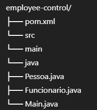

# Employee Control 👩‍💻👨‍💻

Projeto em **Java 21** desenvolvido para teste técnico.  
O objetivo é implementar classes de funcionários e operações de gerenciamento, utilizando boas práticas de **POO (Programação Orientada a Objetos)**, `BigDecimal` para cálculos financeiros e `LocalDate` para datas.

---

## ✅ Funcionalidades implementadas

- **Classe Pessoa**
    - Atributos: `nome` e `dataNascimento`
    - Método para calcular idade

- **Classe Funcionario (extends Pessoa)**
    - Atributos: `salario (BigDecimal)` e `funcao (String)`
    - Métodos getters e setters

- **Classe Main**
    - **3.1** Inserir todos os funcionários conforme tabela
    - **3.2** Remover o funcionário “João”
    - **3.3** Imprimir todos os funcionários (datas em `dd/MM/yyyy`, valores com `.` milhar e `,` decimal)
    - **3.4** Aumentar salários em **10%**
    - **3.5** Agrupar funcionários por função em `Map<String, List<Funcionario>>`
    - **3.6** Imprimir agrupados por função
    - **3.8** Listar aniversariantes dos meses **10** (Outubro) e **12** (Dezembro)
    - **3.9** Encontrar funcionário mais velho (nome + idade)
    - **3.10** Ordenar lista alfabeticamente
    - **3.11** Exibir soma total dos salários
    - **3.12** Calcular quantos salários mínimos (R$ 1212,00) cada funcionário recebe

---

## 📂 Estrutura do projeto

---

## ⚙️ Tecnologias utilizadas

- **Java 21**
- **Maven** (gerenciador de build)
- **IntelliJ IDEA** (IDE principal)
- `LocalDate` (manipulação de datas)
- `BigDecimal` (valores monetários)
- `Stream API` e `Collectors` (agrupamento e ordenação)

---

## ▶️ Como executar no IntelliJ

1. Clone o repositório:
   ```bash
   git clone https://github.com/glauciaandare/employee-control.git
   cd employee-control
   ```
   
   - Selecione o arquivo `pom.xml` como projeto **Maven**
   - Rode a classe `Main.java`

## 🙋 Autor

👤 **Glaucia Andare**  
📧 [gaandare@gmail.com](mailto:gandare@gmail.com)  
🌐 [LinkedIn](https://www.linkedin.com/in/glauciaandare/)

